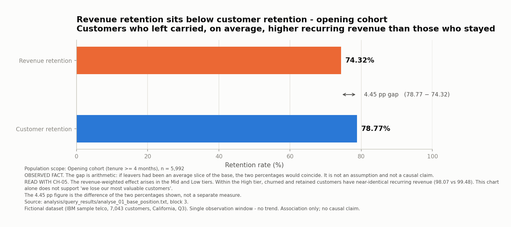
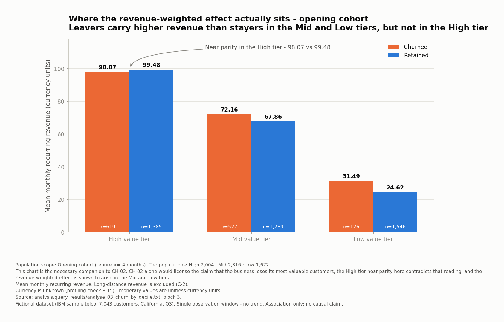
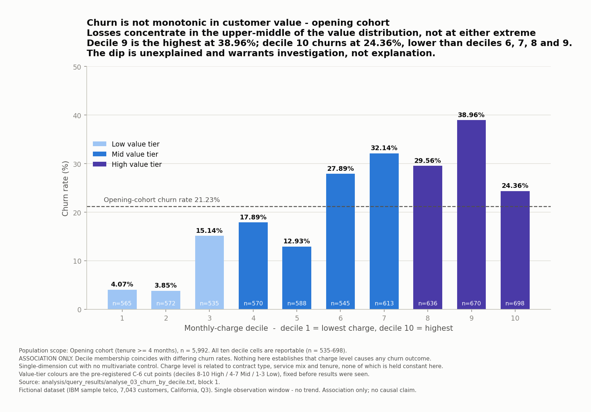
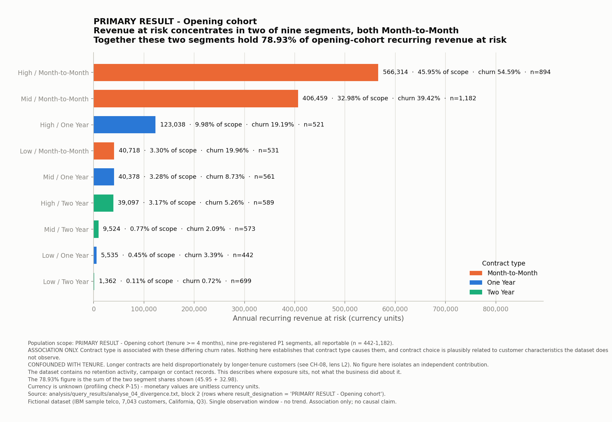
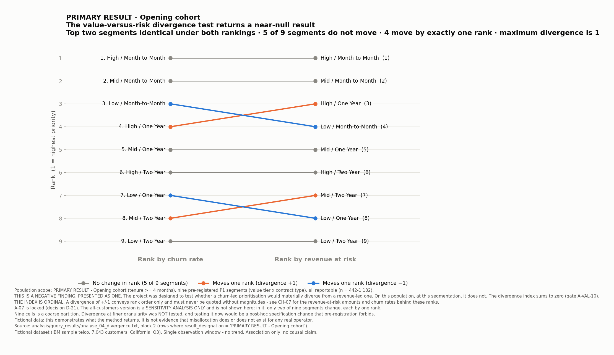
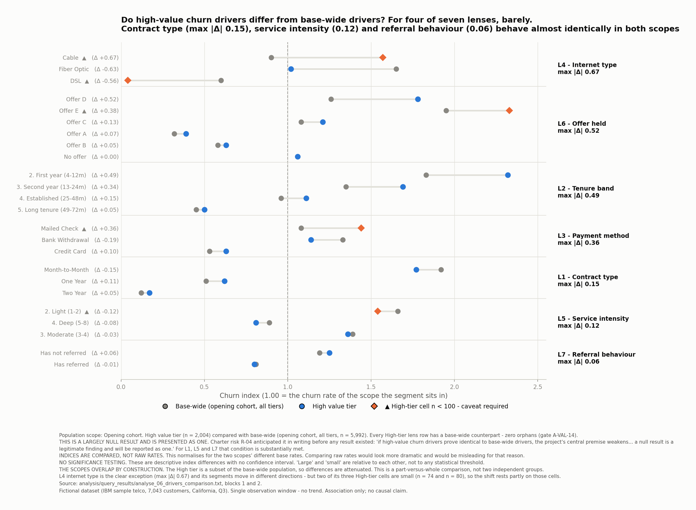
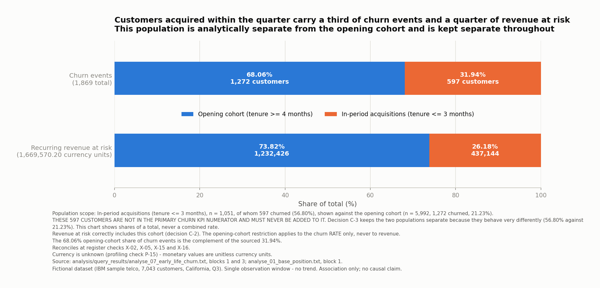

# Telecommunications Revenue Retention

### Prioritising retention investment by revenue at risk

A SQL analytics project on a fictional telecommunications base of 7,043 customers. The question is
not how much churn there is, but **where retention attention would be worth directing**, measured in
annual recurring revenue rather than customer counts.

> **Retention exposure is concentrated among Month-to-Month customers, while customer value alone
> does not explain the pattern.**

> ⚠️ **Read this with the headline.** Contract type is **associated with** these differences. It is
> not shown to cause them. Contract type is heavily related to tenure, and selection into longer
> contracts is plausibly non-random and driven by customer characteristics this dataset does not
> observe. No figure in this project isolates an independent contribution.

**Two pre-registered hypotheses were tested and did not hold. Both are reported.**

---

## At a glance

| Measure | Value | Scope |
|---|---|---|
| Churn rate | **21.23%** (1,272 of 5,992) | Opening cohort, tenure >= 4 months. **Primary KPI** |
| Churn rate | 26.54% (1,869 of 7,043) | All customers. **Reconciliation measure only** |
| Annual recurring revenue at risk | **1,232,425.80 currency units** | Opening cohort, 25.68% of its recurring revenue |
| Revenue retention vs customer retention | **74.32% vs 78.77%** | Opening cohort |
| Share of revenue at risk in two of nine segments | **78.93%** | Opening cohort, both Month-to-Month |
| Early-life churn | **56.80%** (597 of 1,051) | Acquired within the observation quarter |
| Validation | **A-VAL-01 to A-VAL-19 all PASS**; 88/88 chart checks PASS | Whole pipeline |

**Currency is unknown.** Profiling check P-15 found no currency symbol, code or number format in any
source file, so every monetary figure is quoted as unitless currency units. The dataset is
fictional. There is a single observation window, so no trend exists.

**Contents:** [Problem](#the-business-problem) · [Questions](#questions-asked) ·
[Data](#the-dataset-and-what-it-cannot-support) · [Pre-registration](#pre-registration-and-methodology) ·
[Architecture](#data-architecture) · [Findings](#findings) ·
[Hypotheses that did not hold](#two-hypotheses-that-did-not-hold) ·
[Early-life churn](#a-separate-population-early-life-churn) ·
[Validation](#data-quality-and-validation) · [Reproducibility](#reproducibility-and-technical-stack) ·
[Limitations](#limitations-and-open-items) · [Next](#what-i-would-investigate-next)

**Full technical walkthrough:** [`docs/CASE_STUDY.md`](docs/CASE_STUDY.md)

---

## What this project demonstrates

- **Relational modelling in SQL.** A three-layer schema (`raw` to `core` to `analytics`) across 42
  SQL files, with excluded fields structurally prevented from reaching the analysis rather than
  filtered out by convention.
- **Window functions in anger.** `NTILE` with a deterministic tie-break, dual `RANK()` for a
  divergence index, `SUM() OVER` for a cumulative revenue curve, and a `CROSS JOIN LATERAL (VALUES ...)`
  unpivot that renders seven segmentation lenses as one uniform relation.
- **Pre-registered analysis.** Cut points, segments, minimum cell sizes and validation expectations
  were fixed before any result was seen.
- **Data quality work that changed the answer.** Three defects were found and corrected by entry
  rather than deletion, including one that falsified my own initial hypothesis.
- **Evidence-chained reporting.** Every figure traces query to output file to chart to finding.
- **Honest reporting of null results.** Two pre-registered hypotheses did not hold and are reported
  as findings rather than omitted.
- **A reproducible figure pipeline.** No chart value is typed by hand; all eleven figures rebuild
  from the committed query outputs and are checked by an automated gate.

---

## The business problem

A subscription business asking "how do we reduce churn?" is asking a question with no budget
attached. The reframing this project adopts is that **not all churn warrants the same retention
investment**, and that the useful question is where retention attention would be worth directing.

That shifts the unit of analysis from customer counts to **annual recurring revenue at risk**, and
it makes the analysis a prioritisation problem rather than a prediction problem. Churn prediction
and customer lifetime value were both excluded from scope at the charter stage.

> **LIMITATION.** The dataset contains no campaign, offer-made, contact or save records. Nothing
> here observes what any business actually did about retention, and no claim about real operator
> behaviour is made anywhere in this project.

---

## Questions asked

| ID | Business question | Analytical question | Status |
|---|---|---|---|
| BQ-01 | How much annual recurring revenue are we losing to churn? | AQ-01 base position | ✅ Answered |
| BQ-02 | Is that lost revenue concentrated in a few segments, or spread across the base? | AQ-02 revenue distribution | ✅ Answered |
| BQ-03 | Are we losing our most valuable customers, or our least valuable ones? | AQ-03 churn by revenue decile | ✅ Answered |
| BQ-04 | Where would a churn-rate-led prioritisation diverge from a revenue-led one? | AQ-04 divergence index | ⚠️ Answered, **near-null result** |
| BQ-05 | What characteristics most distinguish high-value customers who leave from those who stay? | AQ-05 seven driver lenses, AQ-06 comparison | ⚠️ Answered, **four of seven lenses weak** |
| BQ-06 | Under stated assumptions, how much would it be worth spending to retain each segment? | AQ-07 spend break-even | 🔓 **NOT ATTEMPTED** |

**BQ-06 and AQ-07 are shown as unanswered rather than quietly dropped.** The scenario requires a
margin range the dataset cannot supply, and no externally sourced margin range has been obtained
(open item **B-5**). Inventing one would make the analysis look complete at the cost of making it
false.

---

## The dataset and what it cannot support

IBM's sample telecommunications dataset: **7,043 customers of a fictional operator in California,
one quarter.** Six workbooks were supplied. Five normalised tables were chosen over the single
merged workbook after the merged file was shown to be internally inconsistent, on evidence rather
than preference.

**Five fields were structurally excluded** and contribute to nothing in this project: `Satisfaction
Score`, `Churn Score`, `CLTV`, `Churn Reason` and `Churn Category`. `Satisfaction Score` proved to be
outcome-contaminated, showing 100% churn at scores 1 to 2 and 0% at 4 to 5, with a correlation of
-0.7546 against the outcome. Including it would have produced a model that predicted churn from a
field derived after churn.

Protected characteristics are quarantined in a table that no analytical view joins, and are
restricted to descriptive and fairness checks. They are **never used to target retention
investment**. Compliance is verified mechanically by scanning view definitions, not asserted.

**What this data cannot support:**

- **No trend.** `Quarter` is present but constant. Tenure is a cohort artefact and must not be read
  as a time axis.
- **No currency.** All monetary values are unitless.
- **No retention activity.** No campaign, contact, offer-made or save records exist.
- **No onboarding, channel or campaign data.** Nothing identifies why any customer left.
- **Licence unresolved.** No licensing claim is made, and the source workbooks are not committed.

---

## Pre-registration and methodology

This is the section that makes the null results below credible rather than convenient.

**Before any result was seen,** the following were fixed in writing: the value-tier cut points
(deciles 8 to 10 High, 4 to 7 Mid, 1 to 3 Low), the two segmentation schemes, the minimum reportable
cell size of n = 30 with a caveat band from 30 to 100, and every validation expectation.

**The churn denominator was locked before the rates were computed.** The primary KPI uses the
opening cohort (tenure >= 4 months) so that the numerator and denominator describe the same
population. Customers acquired within the observation quarter are analysed separately throughout and
are **never added to the primary numerator**.

**The divergence population was locked before the divergence result existed.** Decision A-07 fixes
the opening cohort as the primary result and the all-customers version as a labelled sensitivity
analysis. That designation is carried as an explicit column on every row of the query output, so it
is visible in the evidence artefact rather than only in a section header.

A consequence worth stating plainly: pre-registration forbids post-hoc respecification. When the
divergence result came back near-null, testing a finer segmentation to look for a stronger result
would have been a specification change, and was not done.

---

## Data architecture

Three layers in PostgreSQL 18.6, 42 SQL files.

| Layer | Role |
|---|---|
| `raw` | All source columns landed as `TEXT`. No coercion, no cleaning, no loss |
| `core` | Typed and constrained. **Excluded fields are loaded to `raw` but never promoted here**, so no downstream query can reach them by accident |
| `analytics` | Derived attributes and the KPI view surface. Ten views |

The exclusions are enforced **structurally, not by convention**. Restricted demographics live in
`core.restricted_demographics`, which no analytical view joins. Validation checks A-VAL-09 and
A-VAL-19 scan `pg_views` definitions for prohibited references and fail the build if any appear.

Fan-out is controlled by aggregating the customer-to-service bridge to customer grain inside the
analytical base view, so no downstream aggregate can double-count a customer.

---

## Findings

Every claim below is labelled. **OBSERVED FACT** is a value present in a committed query output.
**INTERPRETATION** is what the facts describe. **INFERENCE** goes beyond what the output establishes
and is always marked as such.

### Finding 1: the exposure, and the misreading it invites

**OBSERVED FACT (F-01.9).** In the opening cohort, revenue retention is **74.32%** while customer
retention is **78.77%**.



**INTERPRETATION.** Customers who left carried, on average, higher recurring revenue than those who
stayed. This is arithmetic, not an assumption: had leavers been an average slice of the base, the
two percentages would coincide.

The obvious reading of that chart is "we are losing our most valuable customers". **The evidence does
not support it.**

**OBSERVED FACT (F-03.9, F-03.10, F-03.11).** Within the High value tier, churned customers average
**98.07** monthly recurring revenue and retained customers **99.48**, which is near parity. In the
Mid tier leavers carry **72.16** against **67.86**, and in the Low tier **31.49** against **24.62**.



**INTERPRETATION.** The revenue-weighted effect arises in the Mid and Low tiers, not at the top.
These two charts belong together, and the first without the second would license a claim the data
contradicts.

### Finding 2: is value targeting viable at all?

**OBSERVED FACT (F-02.1, F-02.3).** The top decile by monthly charge holds **16.71%** of recurring
revenue while holding 10.00% of customers. The top three deciles, which form the High value tier,
hold **45.71%**. Half the base holds **69.91%**.

**INTERPRETATION.** Revenue is moderately, not sharply, concentrated. This is well short of the
pattern often assumed in subscription businesses.

**INFERENCE (F-02.a).** A value-based targeting strategy has less mechanical leverage here than it
would in a base where the top decile held, say, 40% of revenue. *This is an inference about strategy
viability, not an observed property of the data.*

📊 [Full Pareto curve, CH-03](docs/CASE_STUDY.md#ch-03-revenue-concentration)

### Finding 3: where churn actually sits in the value range

**OBSERVED FACT (F-03.1 to F-03.4).** Churn by revenue decile in the opening cohort is
non-monotonic: 4.07, 3.85, 15.14, 17.89, 12.93, 27.89, 32.14, 29.56, **38.96**, 24.36 percent for
deciles 1 through 10.



**INTERPRETATION.** Answering BQ-03 directly: the base is losing customers disproportionately from
the **upper-middle** of the value distribution, not from either extreme. Decile 9 is the highest at
38.96%, and decile 10 sits lower at 24.36%, below deciles 6, 7, 8 and 9.

**INFERENCE (F-03.a).** The decile-10 dip is consistent with the highest-charge customers differing
in some respect from decile 9. **The data does not establish what that is.** It could relate to
contract mix, service mix, tenure or something unobserved. **It warrants investigation, not
explanation.**

> **LIMITATION.** Association only. This is a single-dimension cut with no multivariate control.
> Monthly charge is related to contract type, service mix and tenure, none of which is held constant
> here. Nothing establishes that charge level causes any churn outcome.

### Finding 4: where retention exposure concentrates

**OBSERVED FACT (F-04.2, F-04.3, F-04.4).** Of nine pre-registered segments (value tier by contract
type), two hold **78.93%** of opening-cohort recurring revenue at risk. Both are Month-to-Month:
High / Month-to-Month at 566,313.60 currency units (45.95% of scope, churn 54.59%, n = 894) and
Mid / Month-to-Month at 406,459.20 (32.98%, churn 39.42%, n = 1,182).



**OBSERVED FACT (F-04.10).** Within the High value tier alone, churn is **54.59%** on
Month-to-Month, **19.19%** on One Year and **5.26%** on Two Year.

**INTERPRETATION.** Contract type separates churn rates far more sharply than value tier does, and
revenue at risk concentrates accordingly. This is the strongest positive result in the project.

> ⚠️ **This is the most over-readable finding here, so the caveat is not optional.** Contract type is
> **associated with** these differences and is **not shown to cause them**. It is heavily confounded
> with tenure: within the same High tier, churn falls monotonically from 71.57% in the first year to
> 15.52% at long tenure. Customers who choose two-year contracts may differ from those who do not in
> ways this dataset does not observe. **No figure here isolates an independent contribution, and
> nothing here supports the claim that moving customers onto longer contracts would change their
> behaviour.**

📊 [Full seven-lens driver analysis, CH-08](docs/CASE_STUDY.md#ch-08-seven-driver-lenses)

---

## Two hypotheses that did not hold

Both were pre-registered. Both are reported here because a null result obtained from a
pre-registered test is a finding, and omitting it would misrepresent the work.

### 1. Value-versus-risk divergence returned a near-null result

The project was designed to test whether prioritising by churn rate would materially diverge from
prioritising by revenue at risk. **On the primary population, it does not.**



**OBSERVED FACT (F-04.5 to F-04.8).** Across nine segments, the maximum absolute divergence is
**one rank position**. Five of nine segments do not move at all, and four move by exactly one. The
top two segments are identical under both rankings. The divergence index sums to zero, as required
for paired ranks.

**INTERPRETATION.** The central analytical construct of this project did not find what it was
designed to detect. A churn-led prioritisation and a revenue-led one arrive at approximately the
same segment ordering here.

**INFERENCE (F-04.c).** The result may be sensitive to segmentation granularity, since nine cells is
a coarse partition. **This was not tested**, and testing it after seeing the result would be a
post-hoc specification change that pre-registration forbids.

> **LIMITATION.** The divergence index is **ordinal**. A divergence of plus or minus one conveys rank
> order only and must never be quoted without magnitudes; those are in Finding 4 above. This is the
> **primary result on the opening cohort**. An all-customers version exists as a **sensitivity
> analysis only**, in which two of nine segments change by one rank each while seven are unchanged.
> It does not replace the primary result. Because the data is fictional, this demonstrates what the
> method returns; it is not evidence that misallocation does or does not exist for any real operator.

### 2. High-value driver profiles largely match base-wide profiles

**OBSERVED FACT (F-06.1 to F-06.4).** Comparing churn indices between the High value tier and the
base-wide population, the maximum absolute index difference by lens is: internet type **0.67**,
offer held **0.52**, tenure band **0.49**, payment method **0.36**, contract type **0.15**, service
intensity **0.12**, referral behaviour **0.06**.



**INTERPRETATION.** For four of seven lenses the High tier behaves much as the base does. Contract
type, the strongest lens within the High tier, shows one of the **smallest** differences between
scopes. Internet type is the clear exception, and its segments move in different directions.

**INFERENCE (F-06.c).** Taken together, this suggests the High tier is **not** characterised by a
distinctive driver profile across most dimensions examined. *This weakens a premise stated in the
project charter, and is reported plainly rather than minimised.*

**This outcome was anticipated in writing before any result existed.** Charter risk R-04 states:
*"AQ-06 may return a null result ... A null result is a legitimate finding and will be reported as
one."*

> **LIMITATION.** No significance testing. These are descriptive index differences with no
> confidence interval, so "large" and "small" are relative to each other and not to any statistical
> threshold. The two scopes overlap by construction, since the High tier is a subset of the base-wide
> population, so differences are attenuated. Internet type's exception rests partly on cells of
> n = 74 and n = 80.

---

## A separate population: early-life churn

**OBSERVED FACT (F-07.1, F-07.3, F-07.4).** **1,051** customers were acquired within the observation
quarter and **597** of them churned, a rate of **56.80%**. That is **31.94%** of all churn events and
**437,144.40 currency units**, or **26.18%**, of total recurring revenue at risk.



**OBSERVED FACT (F-07.6, F-07.10).** **95.43%** of this cohort (1,003 of 1,051) holds Month-to-Month
contracts. Only two offer categories appear in it at all: Offer E and "No offer". Offers A through D
are entirely absent.

**INTERPRETATION.** This population behaves so differently from the established base, 56.80% against
21.23%, that it is a different analytical question rather than a subset of the same one. This is why
the two are kept separate throughout.

**INFERENCE (F-07.b).** The absence of Offers A to D suggests those offers are associated with
existing rather than newly acquired customers. **This is an inference from absence.** The dataset has
no offer date, eligibility rule or assignment logic, so no conclusion about offer policy is
available.

> **LIMITATION.** These 597 customers are **not** in the primary churn KPI numerator and must never
> be added to it. Revenue at risk correctly includes them; the opening-cohort restriction applies to
> the churn *rate* only. The month-by-month rates within the quarter are **not a survival curve**,
> because each month is a different acquisition group observed for a different length of time.
> **No onboarding cause can be asserted:** the dataset contains no activation, installation,
> complaint, service-quality, first-contact, acquisition-channel or campaign records of any kind.

📊 [Cohort composition detail, CH-11](docs/CASE_STUDY.md#ch-11-early-life-composition)

---

## Data quality and validation

**All nineteen analysis gates pass:** A-VAL-01 through A-VAL-19, including locked KPI reproduction,
driver-lens population integrity and the prohibited-field scan. All eleven charts pass an automated
gate of eight checks each, 88 of 88.

Three defects were found during the build. **All three are corrected by explicit entry, with the
original finding preserved, rather than by deletion.**

| ID | Defect | Consequence |
|---|---|---|
| **V-01** | My own initial hypothesis about the relationship between customer status and tenure was wrong | Corrected by an explicit correction entry. The original is preserved so the audit trail shows a hypothesis tested, found wrong, and fixed |
| **V-10** | The source contains the **literal string `'None'`**, not nulls. pandas had silently coerced it to `NaN` during CSV conversion | Two cleaning checks failed in PostgreSQL and exposed it. This is the case for running data quality checks in the database rather than trusting a dataframe |
| **V-11** | `NTILE(10)` without a tie-break produced non-deterministic decile assignment across runs | Fixed with an explicit `customer_id` tie-break, so deciles are reproducible |

A fourth issue was procedural: a failing script wrote its error to the console while its output file
quietly captured whatever had succeeded. The fix was `ON_ERROR_STOP=1` on every invocation, and it is
documented rather than silently patched.

---

## Reproducibility and technical stack

**PostgreSQL 18.6** (native install, no Docker) · **SQL** for all analysis · **Python** for figures
and source conversion only.

> **Dependencies for this project are `matplotlib` and `openpyxl`. Nothing else is required.**
> The repository-wide `requirements.txt` at the portfolio root covers all eight projects and is far
> broader than this one needs. In particular **pandas is not used here and is not required**: it was
> removed during PREPARE after it silently coerced a real category to `NaN` (defect V-10, described
> below), and every data quality check was moved into the database instead.
>
> ```bash
> pip install matplotlib openpyxl
> ```

```bash
# 1. Build and validate the database (see sql/00_setup/README.md for full run order)
psql -v ON_ERROR_STOP=1 -f sql/00_setup/01_create_schemas.sql
# ... 42 SQL files in documented order, ending with the validation gate

# 2. Rebuild every figure from the committed query outputs
python scripts/build_charts.py

# 3. Verify the figures against the evidence register
python scripts/validate_charts.py     # exit 0 only if all 88 checks pass
```

**No figure value is typed by hand.** `scripts/build_charts.py` parses the committed psql outputs,
writes the exact rows each chart consumed to `outputs/chart_data/`, then renders. A reviewer can open
any audit CSV, compare it to its named source file and block, and reproduce every number on the
corresponding figure. The parser asserts psql's own declared row count against what it parsed, which
is the tripwire for a truncated output file.

The figure scripts require no database connection and no credentials.

---

## Project structure

```
01-sql-telecom-churn-revenue/
├── README.md                        you are here
├── PROJECT_CHARTER.md               the approved scope, questions and risks
├── docs/
│   ├── CASE_STUDY.md                full technical walkthrough
│   ├── DATASET_OPTIONS.md           the Stage 2 dataset shortlist and rejections
│   ├── FINDING_EVIDENCE_REGISTER.md every fact, with scope and source
│   ├── COMMUNICATION_PLAN.md        the approved chart specification
│   ├── COMMUNICATION_VALIDATION.md  88/88 chart validation gate
│   ├── VISUAL_QA.md                 visual quality pass
│   ├── DATASET_VALIDATION.md        the correction register
│   ├── DECISIONS.md                 D-01 to D-22, every locked decision
│   ├── FRAME_SPECIFICATION.md
│   ├── PREPARE_SPECIFICATION.md
│   └── ANALYSE_PLAN.md              written and approved before results
├── sql/
│   ├── 00_setup/                    schemas, raw tables, load, core tables
│   ├── 01_cleaning/                 raw to core promotion, analytical base view
│   ├── 02_eda/                      PREPARE validation
│   ├── 03_analysis/                 seven extracts plus the ANALYSE gate
│   └── 04_kpi_views/                ten KPI and segmentation views
├── scripts/
│   ├── psql_parse.py                deterministic output parser
│   ├── build_charts.py              all eleven figures
│   └── validate_charts.py           the chart gate
├── analysis/query_results/          committed query outputs, the source of truth
├── outputs/
│   ├── figures/                     CH01 to CH11
│   └── chart_data/                  per-chart audit CSVs
└── data/
    ├── DATA_DICTIONARY.md
    └── raw/                         source workbooks NOT committed, licence unresolved
```

---

## Limitations and open items

These constrain the whole project. Finding-level caveats sit with their findings above.

- **Single observation window.** No trend can be established. It cannot be said whether 21.23% is
  rising, falling or stable, and tenure must not be substituted as a time axis.
- **Fictional data.** No statement here is evidence about any real operator or market.
- **Currency unknown.** Every monetary figure is unitless.
- **Association only.** No causal claim is made anywhere. Every relationship is a single-dimension
  association within one quarter with no multivariate control.
- **Recurring revenue only.** Long-distance revenue at risk of **519,603.72 currency units** across
  all churned customers is deliberately held outside the headline, because a retention offer secures
  a subscription rather than a usage volume. It is material, not irrelevant.
- **Annualisation is a convention.** Supported by a profiling check with a median ratio of 1.0000,
  but still a forward-looking assumption.
- **No retention activity data**, so no claim is made about what any business did or should do.
- 🔓 **B-5 open.** No externally sourced margin range. **AQ-07 and BQ-06 are not attempted.**
- 🔓 **B-6 open.** Ofcom's telecommunications market data release was checked and confirmed **not** to
  publish churn or switching rates. **No external benchmark is asserted**, and 21.23% is never
  described as high or low against an industry figure that has not been sourced.

---

## What I would investigate next

Analytical directions, not business recommendations. Nothing in this project supports a
recommendation, and none is offered.

1. **The decile-10 dip.** Why the highest-charge decile churns below deciles 6 through 9 is
   unexplained. Contract mix, service mix and tenure are the obvious candidates to test.
2. **The direction of the offer relationship.** Offer held spans 12.11% to 71.88% within the High
   tier, but the dataset records only which offer is *held*, with no date, reason or outcome. Offers
   may be extended to customers already considered at risk, in which case the association runs
   opposite to the intuitive reading. **This is the most easily misread variable in the project** and
   would need offer-assignment dates before it could be discussed at all.
3. **Multivariate control for the tenure and contract confound.** Every result here is a
   single-dimension cut. A specification that holds tenure constant would test whether contract type
   retains any association independently.
4. **Divergence at finer granularity**, under a fresh pre-registration written before the data is
   re-cut, so the test remains honest.
5. **Closing B-5 and B-6** with sourced figures, which would unblock AQ-07 and allow the churn rate
   to be placed in context.

---

## Licence and data provenance

**Code in this repository** (SQL, Python, documentation) is covered by the
[MIT Licence](../LICENSE) at the portfolio root.

**The source dataset is a separate matter, and its licence is unresolved.** It is IBM sample
telecommunications data describing a fictional operator with 7,043 customers in California over one
quarter. IBM Community publication carries no licence statement; IBM Docs returned HTTP 403; no
Kaggle mirror carries an unambiguous open licence; and the source files contain no embedded licence,
copyright notice or terms.

**Position: unresolved. No licensing claim is made, and redistribution is assumed not to be
permitted.** The six source workbooks are therefore **not committed to this repository**, and neither
are the CSV intermediates derived from them. Both are excluded by `.gitignore`. Provenance and
retrieval are documented in [`data/raw/README.md`](data/raw/README.md) and in the portfolio
[Dataset Registry](../_portfolio/DATASET_REGISTRY.md).

Every committed query output in `analysis/query_results/` is an aggregate produced by this project's
own SQL. No row-level source data is republished here.

---

<sub>All monetary values are unitless currency units: profiling check P-15 found no currency symbol,
code or number format in any source file. The data is fictional, so no statement in this project is
evidence about any real operator or market. No causal claim is made anywhere.</sub>
