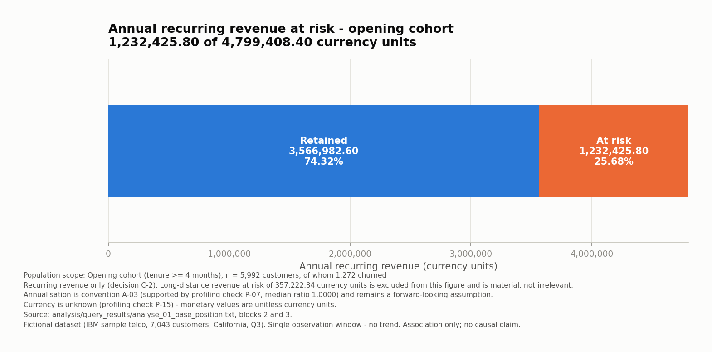
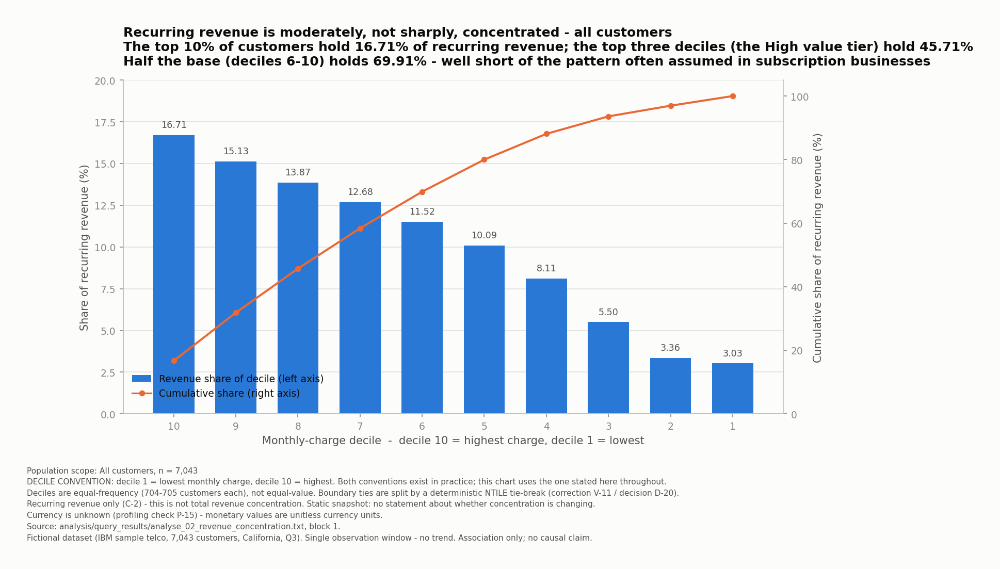
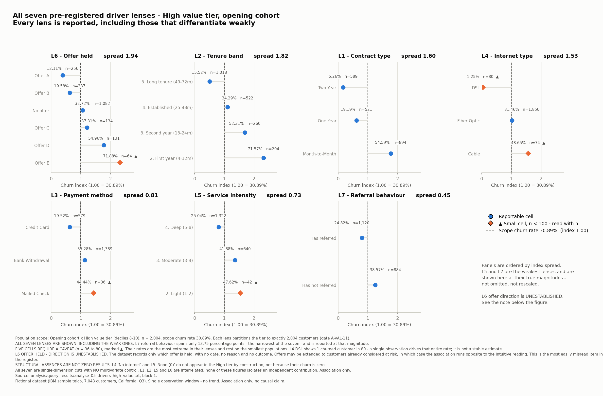
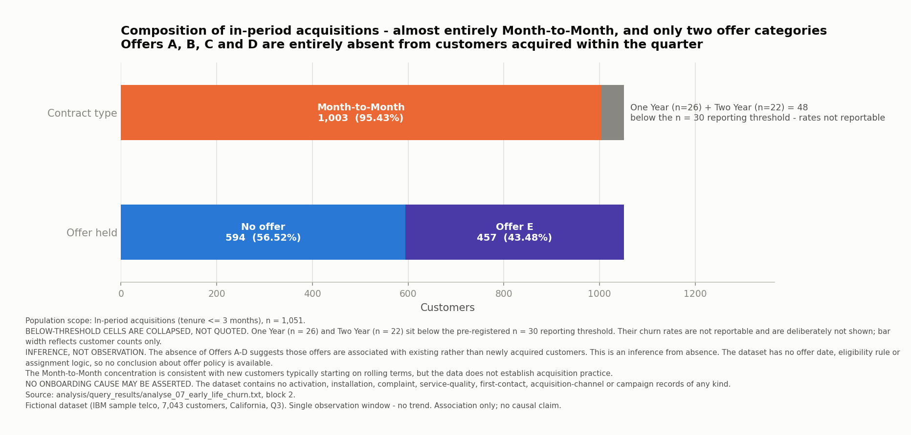

# Case Study

### Telecom Customer Churn & Revenue Analysis

**A technical walkthrough of the analysis, including the two tests that returned weak results.**

The [README](../README.md) carries the headline figures, [Findings](findings.md) sets out each result
in turn, and [Recommendations](recommendations.md) sets out what follows from them. This document covers
the working underneath: why the dataset was chosen, what was excluded and why, the SQL that does the
heavy lifting, the issues found and corrected along the way, and four charts that support the results.

Every figure quoted here comes from a committed query output in `analysis/query_results/`, traced
through [Findings and Evidence](technical/findings-and-evidence.md).

---

## Contents

1. [How the question was framed](#1-how-the-question-was-framed)
2. [Choosing the dataset, and proving the alternative defective](#2-choosing-the-dataset-and-proving-the-alternative-defective)
3. [What was excluded, and why it mattered](#3-what-was-excluded-and-why-it-mattered)
4. [Definitions fixed before results](#4-definitions-fixed-before-results)
5. [The data architecture](#5-the-data-architecture)
6. [The SQL that does the work](#6-the-sql-that-does-the-work)
7. [Three issues found, corrected by entry](#7-three-issues-found-corrected-by-entry)
8. [CH-01: the base position](#ch-01-the-base-position)
9. [CH-03: revenue concentration](#ch-03-revenue-concentration)
10. [CH-08: seven driver lenses](#ch-08-seven-driver-lenses)
11. [CH-11: early-life composition](#ch-11-early-life-composition)
12. [Validation](#12-validation)
13. [How every claim traces to source](#13-how-every-claim-traces-to-source)
14. [What would be done differently](#14-what-would-be-done-differently)

---

## 1. How the question was framed

The dataset is one of the most analysed in public circulation. Producing another churn-prediction
notebook would have demonstrated nothing.

The framing adopted instead: **not all churn warrants the same retention investment.** The objective
is not to minimise churn at any cost but to establish where retention attention would be worth
directing, measured in annual recurring revenue rather than customer counts.

Three things were excluded from scope at the outset and stayed excluded:

- **Churn prediction.** A prediction model answers "who will leave", which is a different question
  from "where is the exposure".
- **Customer lifetime value.** The `CLTV` field is present but is a vendor-supplied derived score of
  unknown construction. Using it would have imported an unexamined model into the analysis.
- **Any claim about what a business should do.** The dataset contains no retention activity records,
  so what any operator actually did is unobservable.

> **LIMITATION.** The reframing is an analytical choice, not a claim that any operator holds this
> view. The dataset contains no campaign, offer-made, contact or save records.

---

## 2. Choosing the dataset, and proving the alternative defective

Six workbooks were supplied: one merged file and five normalised tables covering demographics,
location, population, services and status.

The merged workbook is the more convenient source. It was rejected, and **the rejection was made on
evidence rather than preference** : a cross-check against the five-table source
found the merged file internally inconsistent. Convenience is not a reason to trust a file that
disagrees with its own components.

A second verification result is worth recording because it shaped the whole analysis. **`Customer
Status` is fully derived, not independent:**

- `'Joined'` is exactly equivalent to `tenure <= 3 AND not churned` (454 customers, exact match)
- `'Stayed'` is exactly equivalent to `tenure >= 4 AND not churned` (4,720 customers, exact match)

That is why the cohort split in this project is defensible rather than arbitrary. It is not an
analyst's choice imposed on the data; it is the structure already present in it.

---

## 3. What was excluded, and why it mattered

Five fields were **excluded at the database level**, meaning they are loaded to the `raw` layer for fidelity
but never promoted to `core`, so no downstream query can reach them:

| Field | Reason |
|---|---|
| `Satisfaction Score` | **Recorded with knowledge of the outcome.** 100% churn at scores 1 to 2, 0% at 4 to 5, correlation -0.7546 against the outcome |
| `Churn Score` | Vendor-supplied propensity score of unknown construction |
| `CLTV` | Vendor-supplied derived value of unknown construction |
| `Churn Reason` | Recorded after the outcome. Using it would produce circular findings |
| `Churn Category` | Same |

**`Satisfaction Score` is the one worth dwelling on.** A model built on it would have shown
outstanding accuracy and been worthless, because the score is assigned in the knowledge of the
outcome. This is the most common way a churn analysis on this dataset goes quietly wrong.

**Protected characteristics** are quarantined in `core.restricted_demographics`, a table that no
analytical view joins. They are restricted to descriptive and fairness checks and are **never used to
target retention investment**. This is enforced, not promised: validation checks A-VAL-09 and
A-VAL-19 scan `pg_views` definitions for prohibited references and fail the build if any appear.

---

## 4. Definitions fixed before results

The decisions that determine whether the results can be trusted are set out in
[Methodology](methodology.md). Five matter most, and are summarised here with the reasoning.

### What counts as revenue at risk

Revenue at risk is **annualised recurring revenue from all churned customers**. Long-distance revenue
is quantified but held outside the headline, because a retention offer secures a subscription rather
than a usage volume.

The long-distance exposure is **519,603.72 currency units** across all churned customers, roughly 31%
of the recurring figure again. It is stated everywhere it is excluded, so that the exclusion reads as
a scoping decision rather than an oversight.

### The churn rate denominator

The primary KPI uses the **opening cohort**, tenure >= 4 months, so numerator and denominator
describe the same population.

An asymmetric alternative was considered and **withdrawn as incoherent** during design: excluding
only the `'Joined'` customers would have removed 454 survivors while keeping 597 churners, inflating
the rate by construction. It was retracted rather than presented as a live option.

> The denominator was fixed **before** either rate was computed, precisely so that it could not be
> chosen on the strength of the result. The all-customer rate of 26.54% is retained as a
> reconciliation measure and is never substituted for the primary 21.23%.

### Value bands and reporting thresholds

Value tiers: deciles 8 to 10 High, 4 to 7 Mid, 1 to 3 Low. Minimum reportable cell size n = 30, with
a caveat band from 30 to 100 requiring `n` to be quoted alongside any rate. Seven driver lenses,
named in advance.

### The comparison population for the ranking test

**PRIMARY RESULT: opening cohort. SENSITIVITY ANALYSIS ONLY: all customers.**

This was settled **before the divergence result was seen**. It travels as an explicit
`result_designation` column on every row of the query output, so the designation sits in the data
itself rather than in a section header that could drift away from it.

The sensitivity test does real work: including in-period acquisitions swaps the top two positions on
the revenue-at-risk ranking and leaves the remaining seven segments unchanged. The primary result
therefore holds regardless of the scope decision, which is something that can be shown rather than
asserted.

### What fixing definitions in advance costs

When the divergence result came back weak, the tempting move was to re-cut at a finer granularity
until something appeared. Doing that would have meant choosing a specification after seeing the
answer. A finer-grained test may well be worth running, but it needs its own definitions written
before the data is re-cut, so it is listed as further work instead.

---

## 5. The data architecture

```
                 six source workbooks (not committed, licence unresolved)
                                    |
                                    v
   raw      all columns as TEXT. No coercion, no cleaning, no loss.
            Excluded fields land here and stop here.
                                    |
                                    v
   core     typed, constrained, deduplicated.
            dim_customer · dim_location · dim_population · dim_contract
            dim_service (11 services) · fact_customer_status
            bridge_customer_service
            restricted_demographics  <-- quarantined, joined by nothing
                                    |
                                    v
 analytics  vw_customer_analytical_base
            ten KPI and segmentation views
```

Three design points worth naming:

**Exclusions are structural.** A field that never reaches `core` cannot be used by accident in
`analytics`. This is stronger than filtering it out in each query and remembering to keep doing so.

**Fan-out is controlled at the boundary.** `bridge_customer_service` is one row per customer per
service. It is aggregated to customer grain **inside** `vw_customer_analytical_base`, so no
downstream aggregate can double-count a customer. Validation check A-VAL-11 confirms each of the
seven driver lenses partitions the High tier to exactly 2,004 customers.

**Boolean conversion fails loudly.** `core.yn_to_bool` raises on any value it does not recognise
rather than defaulting to false, so an unexpected category stops the build instead of silently
becoming a negative.

---

## 6. The SQL that does the work

### Deterministic deciles (reproducible decile assignment)

`NTILE` without a tie-break assigns tied values arbitrarily, so two runs can produce different
deciles. The fix makes the assignment reproducible:

```sql
deciled AS (
    SELECT b.*,
           NTILE(10) OVER (ORDER BY b.monthly_charge, b.customer_id)::smallint
               AS revenue_decile
    FROM   base AS b
)
```

An informational check recorded five charge values spanning a decile boundary, so this is not a
theoretical concern on this data.

### Seven lenses as one relation

Rather than seven near-identical queries, the driver lenses are unpivoted into a single uniform
relation. Adding a lens means adding a row here, not writing another query:

```sql
CROSS JOIN LATERAL (VALUES
    ('L1','Contract type',      b.contract_type),
    ('L2','Tenure band',        b.tenure_band),
    ('L3','Payment method',     b.payment_method),
    ('L4','Internet type',      b.internet_type),
    ('L5','Service intensity',  b.service_intensity_band),
    ('L6','Offer held',         b.offer),
    ('L7','Referral behaviour',
        CASE WHEN b.has_referred THEN 'Has referred' ELSE 'Has not referred' END)
) AS v(lens_id, lens_name, segment_value)
```

This also guarantees that every lens covers the same population, which is what makes the A-VAL-11
partition check meaningful.

### The literal `'None'` problem (the literal 'None' token)

The source stores a **literal string** `'None'` where an analyst would expect a null. The fix maps
the literal, the null and the empty string to one approved label:

```sql
CASE WHEN offer IS NULL
       OR trim(offer) = ''
       OR trim(offer) = 'None'  THEN 'No offer'
     ELSE trim(offer) END,
```

### The divergence index

Two independent rankings over the same nine segments, and their difference:

```sql
RANK() OVER (PARTITION BY population_scope ORDER BY churn_rate_pct        DESC) AS rank_by_churn_rate,
RANK() OVER (PARTITION BY population_scope ORDER BY arr_at_risk           DESC) AS rank_by_arr_at_risk
```

The index is the difference of the two ranks. Because they are paired ranks over the same set, the
index must sum to zero within a scope, which is exactly what validation check A-VAL-10 asserts. It
does, in both scopes.

---

## 7. Three issues found, corrected by entry

In each case the original finding is preserved alongside the correction rather than overwritten, so
the record shows what was believed, what was tested, and what changed.

### An early assumption did not survive verification

An initial assessment of the relationship between `Customer Status` and tenure proved incorrect. It
was corrected through an explicit correction entry with the original retained verbatim, so the record
shows an assumption tested, found wrong and fixed, rather than a clean account that was never in
doubt.

### A category disappeared during file conversion

Two cleaning checks failed. The root cause was not a SQL bug: **pandas had silently coerced the
literal string `'None'` to `NaN`** during the CSV conversion step, so a real category had vanished
before the data reached PostgreSQL.

This was caught only because the checks ran **in the database**, against the actual loaded values,
rather than against a dataframe. It is the strongest argument in this project for validating where
the data lives.

The converter was subsequently rewritten on `openpyxl` with `data_only=True`, which also removed a
dependency and handled the workbooks' `calcChain` correctly.

### Non-deterministic deciles

`NTILE` without a tie-break. Found by a validation check that compared decile assignment across
runs, fixed as shown in section 6, and recorded.

### A fourth issue, procedural

A failing SQL script wrote its error to the console while its output file quietly captured whatever
had succeeded, so a failure looked like a partial success. The fix is `ON_ERROR_STOP=1` on every
invocation, and it is documented in the run guides rather than silently patched.

A related labelling defect: `\echo` section headers write to stdout, not to the `-o` output file, so
population labels never reached the committed evidence. The fix (D-22) was to add explicit
`population_scope`, `result_designation`, `scope_cohort` and `check_id` **columns** to the result
sets, so scope travels inside the data. **No WHERE clause, population, calculation, KPI, ranking,
segmentation, cut point, ordering or validation expectation was changed in that repair**, and the
analytical values were confirmed identical afterwards.

---

## Supporting charts

The four figures below support the README's findings. They are here rather than inline so the README
stays scannable.

### CH-01: the base position



**OBSERVED FACT (F-01.4, F-01.7, F-01.10).** Opening-cohort recurring revenue is **4,799,408.40
currency units**. Of that, **1,232,425.80** is at risk, **25.68%**, leaving **3,566,982.60** retained,
**74.32%**.

**Source:** `analyse_01_base_position.txt`, blocks 2 and 3 · **Scope:** opening cohort, n = 5,992.

> **LIMITATION.** Recurring revenue only, per decision C-2. Long-distance revenue at risk of
> **357,222.84 currency units** in this cohort is excluded from the figure and is material.
> Annualisation is a convention. Currency is unknown.

### CH-03: revenue concentration



**OBSERVED FACT (F-02.1, F-02.3, F-02.7).** The top decile holds **16.71%** of recurring revenue while
holding 10.00% of customers. The top two deciles hold **31.84%**, the top three **45.71%**, and the
bottom three **11.89%**. Revenue share falls smoothly from 16.71% to **3.03%**, a ratio of roughly
5.5 to 1, with no step change.

**INTERPRETATION.** Moderate rather than sharp concentration, and a continuous distribution rather
than distinct commercial tiers.

**INFERENCE (F-02.b).** The absence of a step change is consistent with a single continuous pricing
structure rather than distinct product tiers. **The data does not establish the operator's pricing
architecture.**

**Source:** `analyse_02_revenue_concentration.txt`, block 1 · **Scope:** all customers, n = 7,043.

> **LIMITATION.** Decile 1 is the **lowest** monthly charge here; both conventions exist in practice.
> Deciles are equal-frequency (704 to 705 customers each), not equal-value. Recurring revenue only, so
> this is not total revenue concentration. Static snapshot.

### CH-08: seven driver lenses

This is the full AQ-05 diagnostic, and the reason the README's Finding 4 can be stated at all.



**Scope:** opening cohort by High value tier, **n = 2,004**, scope churn rate **30.89%**. Each lens
partitions the tier to exactly 2,004 customers (A-VAL-11).

**All seven lenses are reported, including the weak ones.** The chart orders its panels by churn-index
spread, which is a presentation derivation from the plotted indices and affects arrangement only. The
rows below quote the **sourced churn rates** at each lens extreme, in the same order:

| Lens | Range within the High tier |
|---|---|
| **L6** Offer held | Offer A **12.11%** to Offer E **71.88%** |
| **L2** Tenure band | Long tenure **15.52%** to first year **71.57%** |
| **L1** Contract type | Two Year **5.26%** to Month-to-Month **54.59%** |
| **L4** Internet type | DSL **1.25%** to Cable **48.65%** |
| **L3** Payment method | Credit Card **19.52%** to Mailed Check **44.44%** |
| **L5** Service intensity | Deep **25.04%** to Light **47.62%** |
| **L7** Referral behaviour | Has referred **24.82%** to has not referred **38.57%** |

**OBSERVED FACT (F-05.2).** Tenure band declines **monotonically** across all four bands, from 71.57%
in the first year to 15.52% at long tenure. It is the cleanest pattern in the group.

**OBSERVED FACT (F-05.10).** Referral behaviour spans **13.75 percentage points**, the narrowest of
the seven. It is reported at that magnitude rather than omitted.

**INFERENCE (F-05.a).** Contractual commitment and relationship length are the dimensions most
strongly associated with churn within the High tier. **Association only, and these variables are
heavily interrelated**, since long-tenure customers are more likely to hold long contracts.

> ⚠️ **INFERENCE (F-05.b), and the most easily misread item in the whole project.** Offer held shows
> the widest spread of any lens, and **the direction of the relationship is entirely unestablished.**
> The dataset records only which offer is *held*, with no date, no reason and no outcome. Offers may
> be extended to customers already considered at risk, in which case the association runs opposite to
> the intuitive reading. **This lens warrants investigation of direction before it is discussed at
> all.**

> **LIMITATION.** All seven are single-dimension cuts with **no multivariate control**; none isolates
> an independent contribution. **Five cells require a caveat** and are marked on the chart with their
> `n`: Mailed Check (36), Light service intensity (42), Offer E (64), Cable (74), DSL (80). **DSL's
> 1.25% rests on a single churned customer in 80** and is not a stable estimate. **Structural
> absences are not zero results:** "No internet" and "None" do not appear in the High tier by
> construction, not because their churn is zero.

**Source:** `analyse_05_drivers_high_value.txt`, block 1.

### CH-11: early-life composition



**OBSERVED FACT (F-07.6, F-07.10).** **95.43%** of in-period acquisitions (1,003 of 1,051) hold
Month-to-Month contracts. Only **Offer E** (457 customers, 61.71% churn) and **"No offer"** (594
customers, 53.03%) appear. Offers A through D are entirely absent.

**INFERENCE (F-07.a).** The Month-to-Month concentration is consistent with new customers typically
starting on rolling terms. **The data does not establish acquisition practice**, and this composition
alone would produce a higher aggregate churn rate for the cohort given the contract-type association.

**Source:** `analyse_07_early_life_churn.txt`, block 2 · **Scope:** in-period acquisitions, n = 1,051.

> **LIMITATION.** One Year (n = 26) and Two Year (n = 22) sit **below the n = 30 reporting
> threshold**. Their churn rates are not reportable and are deliberately not shown; bar width reflects
> customer counts only.

---

## 12. Validation

### The analysis gate

Nineteen checks, A-VAL-01 through A-VAL-19, **all PASS**. Three are load-bearing:

| Check | What it proves |
|---|---|
| **A-VAL-02a / 02b** | The locked KPIs still reproduce. If these fail, something upstream has changed |
| **A-VAL-11** | Each driver lens partitions its scope exactly. A failure means a customer is double-counted or missing |
| **A-VAL-19** | No prohibited field has reached an analytics view. Scans `pg_views` definitions directly |

Others confirm cohort partitioning (A-VAL-01), that the divergence index sums to zero per scope
(A-VAL-10), that both divergence populations sum correctly (A-VAL-08a / 08b), and that every
High-tier lens row has a base-wide counterpart with zero orphans (A-VAL-14).

**A failure returns for review.** Under the immutability rule it does not license adjusting a
definition or an expectation to make a check pass.

### The chart gate

Eleven charts, eight checks each, **88 of 88 PASS**. See
[Technical Notes](technical/technical-notes.md).

Values are compared as **strings**, not floats, so a figure that has been re-rounded or reformatted
fails rather than passing on numeric tolerance. The gate also scans every title, label and annotation
for causal verbs, confirms the two null-result charts state their nulls in their own titles, confirms
all seven lenses are present in the driver charts, and confirms the A-07 designation on the divergence
charts.

### Visual quality

Eleven charts inspected against the communication plan: **5 PASS, 5 MINOR FIX, 1 MAJOR FIX**, all
fixes applied and re-verified, with audit CSVs confirmed byte-identical afterwards. See
[Technical Notes](technical/technical-notes.md).

---

## 13. How every claim traces to source

Every claim traces back through a fixed chain:

```
BQ-nn  business question
 └─ AQ-nn  analytical question
     └─ F-nn     finding group
         └─ F-nn.n   observed fact, with scope and source file
             └─ E-nn.n   evidence pointer to output file and block
                 └─ INT   interpretation
                     └─ INF   inference, always labelled
                         └─ LIM   limitation
                             └─ CH-nn  chart
```

Seventeen cross-finding arithmetic reconciliations (X-01 to X-17) hold exactly. For example:

- Cohorts sum to the base: 5,992 + 1,051 = **7,043**
- Churn counts sum: 1,272 + 597 = **1,869**
- Revenue at risk sums: 1,232,425.80 + 437,144.40 = **1,669,570.20**
- Divergence index sums to zero in both scopes

**One point of apparent tension is stated in the register rather than left for a reader to find.**
F-01.9 shows churned customers carrying above-average recurring revenue overall, while F-03.9 shows
High-tier churned and retained customers at near parity (98.07 vs 99.48). These are consistent: the
revenue-weighted effect arises in the Mid and Low tiers. Any narrative must reflect that rather than
the simpler claim that the business loses its most valuable customers.

---

## 14. What would be done differently

- **Run data quality checks in the database from the start.** The V-10 defect existed for an entire
  stage because a dataframe had silently removed a category. Checks against the loaded data would
  have caught it immediately.
- **Set `ON_ERROR_STOP=1` from the first command, not after a silent failure.**
- **Put scope in the data, not in section headers.** The console-header labelling defect existed because
  labels lived in console output rather than in result columns. Explicit scope columns (D-22) make
  the artefact self-describing.
- **Define the granularity sensitivity in advance too.** The divergence result is specific to a
  nine-cell partition, and pre-registering a coarse and a fine variant would have allowed the
  granularity question to be answered rather than deferred.

---

## Open items

🔓 **B-5.** No externally sourced margin range. **AQ-07 and BQ-06 are not attempted.** No margin,
break-even point or spend ceiling is estimated anywhere.

🔓 **B-6.** Ofcom's telecommunications market data release was checked and confirmed **not** to
publish churn or switching rates. **No external benchmark is asserted**, and 21.23% is never
described as high or low against an industry figure that has not been sourced.

---

<sub>Dataset: IBM sample telecommunications data, a fictional operator with 7,043 customers in
California, one quarter. Licensing unresolved; source workbooks are not committed. No licensing claim
is made. All monetary values are unitless currency units. No causal claim is made anywhere in this
project.</sub>

---

*Findings in full: [`findings.md`](findings.md). Recommendations: [`recommendations.md`](recommendations.md). Method and definitions: [`methodology.md`](methodology.md). Supporting technical documentation: [`technical/`](technical/).*
