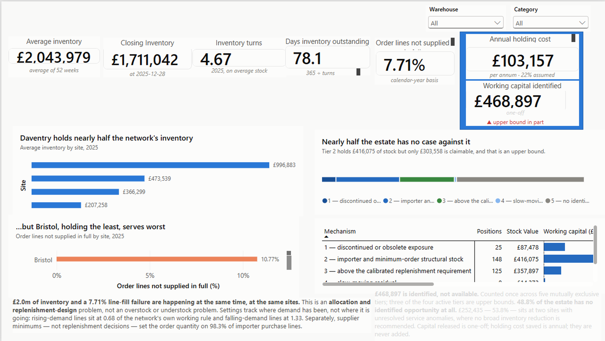
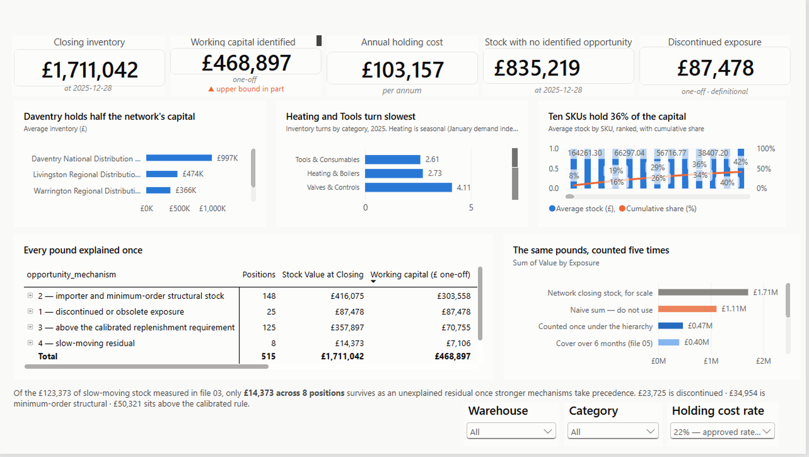
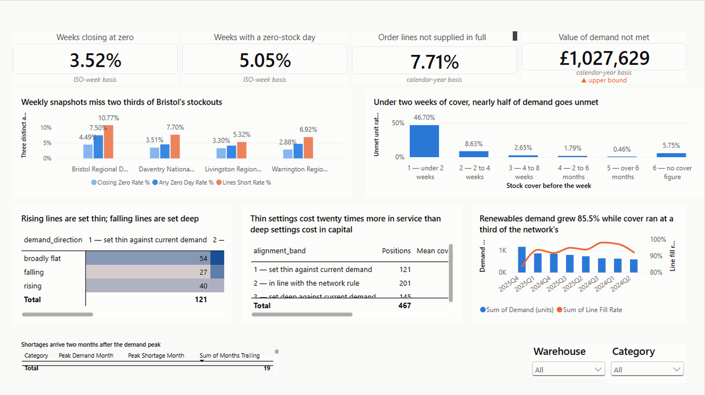
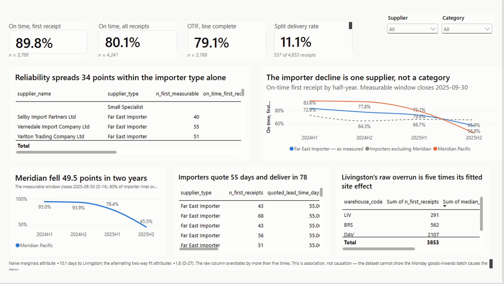
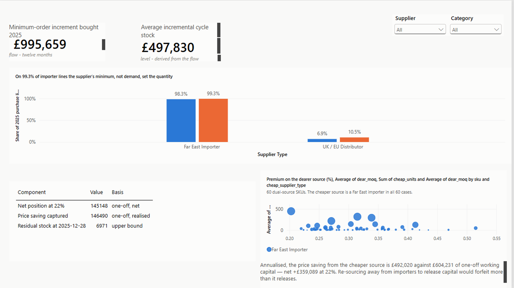
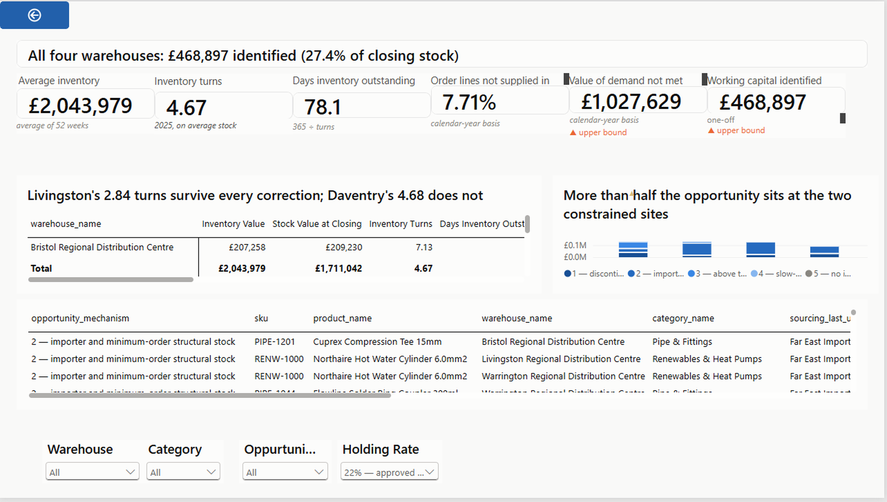

# Warehouse Inventory & Supply Chain Performance

**A PostgreSQL analysis of where working capital is trapped in a UK trade distributor — and why
the same business is simultaneously overstocked and out of stock.**

> **This dataset is synthetic.** Calderfield Trade Supplies Ltd is a fictional company. Every
> pattern in the data was placed there by a documented generator (`scripts/calderfield_dataset_generator.py`,
> seed 20240101) and the whole dataset rebuilds reproducibly from that seed. **The deliverable is
> the analytical method, not a claim about any real business, supplier or market.**

**Tool:** PostgreSQL 16 · **Scale:** 147,589 rows across 15 tables · **Period:** 2024–2025
**Pipeline:** 35 SQL files, 32 committed results, rebuilds from empty with zero failures
**Dashboard:** Power BI, six pages · [jump to the screenshots](#power-bi-dashboard)

---

## Reading order

| | Document | What it gives you |
|---|---|---|
| 1 | [`docs/EXECUTIVE_SUMMARY.md`](docs/EXECUTIVE_SUMMARY.md) | The argument in two pages |
| 2 | [The dashboard](#power-bi-dashboard) | Six pages, screenshots below |
| 3 | [`docs/KEY_FINDINGS.md`](docs/KEY_FINDINGS.md) | Every finding, classified by the kind of claim it is |
| 4 | [`docs/RECOMMENDATIONS.md`](docs/RECOMMENDATIONS.md) | What to do, in three priority tiers |
| 5 | [`docs/METHODOLOGY.md`](docs/METHODOLOGY.md) | How the numbers were built and what they exclude |
| 6 | [`sql/`](sql/) | 35 files: setup → validation → preparation → analysis → reporting views |
| 7 | [`docs/DECISIONS.md`](docs/DECISIONS.md) · [`powerbi/VALIDATION_LOG.md`](powerbi/VALIDATION_LOG.md) · [`analysis/query_results/`](analysis/query_results/) | 42 recorded decisions, the dashboard validation log, and the committed results every figure traces to |

**Short on time?** Read the executive summary and look at page 1 of the dashboard. That is the
whole argument.

---

## Power BI dashboard

Six pages built on the seven reporting views, in Import mode against PostgreSQL. Each page answers
one question, and each visual title states a finding rather than naming a variable.

📄 **[Full six-page PDF export](powerbi/calderfield_inventory_supply_chain.pdf)**

### 1 · Executive Overview
*How can we hold £2.0m of stock and still miss 7.71% of order lines?*



### 2 · Inventory & Working Capital
*Where is the capital, and what mechanism explains each pound?*



### 3 · Availability & Replenishment
*Why do stockouts happen despite the stock?*



### 4 · Supplier Reliability & Lead Time
*How reliable are our suppliers, and how long do they take?*



### 5 · Sourcing Economics
*What is our sourcing structure actually costing us?*



### 6 · Site Investigations & Decision Watchlist
*What do we do, and what do we still not know?*



### Why there is no `.pbix` in this repository

A `.pbix` is an opaque binary. It cannot be diffed, reviewed in a pull request, or opened without
installing Power BI Desktop, so this repository excludes it by policy and ships everything needed
to understand and rebuild the report instead:

- **Screenshots and a PDF** — the finished report, viewable in the browser
- **The data model and every measure**, specified in [`docs/POWER_BI_STEP_BY_STEP_BUILD_GUIDE.md`](docs/POWER_BI_STEP_BY_STEP_BUILD_GUIDE.md) — 16 DAX measures, 15 relationships, field wells and formatting for every visual
- **The validation log** at [`powerbi/VALIDATION_LOG.md`](powerbi/VALIDATION_LOG.md), reconciling each KPI to its committed SQL result
- **The theme** at [`powerbi/theme/calderfield_theme.json`](powerbi/theme/calderfield_theme.json)
- **The SQL and the data**, so the seven reporting views the report reads can be rebuilt from empty in about five minutes

The dashboard is a presentation layer over results that live in this repository. The evidence is
the SQL, and the SQL is all here.

---

## Business context

Calderfield is a UK wholesale distributor of plumbing, heating, ventilation and electrical
products, selling to trade accounts rather than the public. It runs a national distribution centre
at Daventry and three regional sites at Warrington, Bristol and Livingston. Bristol opened on
1 July 2024 and is still ramping.

It buys from 30 suppliers across four types — UK manufacturers, UK and European distributors, Far
East importers and small specialists — whose quoted lead times run from 7 to 55 days and whose
prices differ by around 21% for equivalent goods. **88 of 250 SKUs have more than one approved
source**, so for a third of the range there is a real buying choice being made every time stock is
replenished.

Replenishment runs on reorder points and reorder quantities held per SKU per site, set by five
buyers and reviewed on a nominal cycle.

---

## The problem

Calderfield carries **£2.04m of average inventory** against **£9.55m of cost of sales** — 4.67
turns, 78 days of cover. That average conceals a four-way split: Livingston turns 2.84 times and
Bristol 7.13.

At the same time, the business is not supplying its customers. In 2025 it failed to supply
**7.71% of order lines in full**, on demand worth up to **£1.03m** at the prices those customers
had already been quoted.

**Cash is tied up and service is being missed — at the same time, and in some cases at the same
sites.** The board has asked why, and what to do about it.

---

## Central question

> **Where is working capital tied up, and which inventory and supply chain decisions are costing
> the business money?**

**Primary stakeholder:** Operations Director, who owns the warehouse network, the replenishment
policy and the supplier relationships, and is accountable for both the capital tied up in stock
and the service level the sales team can promise.

Eight business questions and seventeen analytical questions are defined in
[`PROJECT_CHARTER.md`](PROJECT_CHARTER.md), one analysis file per analytical question.

---

## Dataset overview

15 related tables, 147,589 rows, two full years of trading.

| Table | Rows | Grain |
|---|---:|---|
| `inventory_snapshot` | 51,220 | SKU × site × week |
| `stock_movement` | 39,752 | Individual ledger movement |
| `sales_order_line` | 33,422 | Customer order line |
| `sales_order` | 10,027 | Customer order |
| `goods_receipt_line` | 4,853 | Goods receipt |
| `purchase_order_line` | 4,457 | Purchase order line |
| `purchase_order` | 2,103 | Purchase order |
| `customer` | 500 | Trade account |
| `replenishment_policy` | 515 | SKU × site |
| `product_supplier` | 344 | Sourcing agreement |
| `product` | 250 | SKU |
| `calendar_week` | 104 | ISO week |
| `supplier` | 30 | Supplier |
| `product_category` | 8 | Category |
| `warehouse` | 4 | Site |

**Deliberately imperfect, because real data is.** The generator was instructed not to produce
clean data, and the imperfections are handled rather than removed:

| Issue | Measured | Handling |
|---|---|---|
| Duplicate customer accounts | 31 accounts; 500 resolve to 469 customers | Resolved in a preparation view before any concentration claim |
| Missing promised delivery dates | 22 purchase orders (1.1%) | Excluded from lateness; denominator printed |
| Promised date before order date | 24 purchase orders (1.3%) | Excluded; reported as a buyer keying issue |
| Split deliveries | 537 of 4,853 receipts (11.1%) | Both on-time measures reported; split rate on every row |
| Livingston Monday booking batch | 39.8% of its receipts vs 14–21% elsewhere | Receiving site held constant, then fitted |
| Missing product dimensions | 10 of 250 products (4.0%) | Gap stated rather than dropped |
| End-of-period truncation | 77% of Q4 2025 importer orders never received | Measurement window closes 2025-09-30 |
| Stock loss above real-world norms | 7.9% of average stock a year | Reported comparatively, never as an absolute |

**Expensive products do not automatically sell in high volume**, and no column in the source data
names a business problem — the findings had to be discovered, not read off a flag.

---

## Database architecture

```
supply schema — 15 tables, PK/FK/CHECK enforced throughout
   │
   ├── 01_setup/          Schema · CSV load · 11 analysis indexes
   ├── 02_validation/     Row counts · referential integrity · ledger rebuild · coverage profile
   ├── 03_preparation/    4 base views, read by everything downstream
   ├── 04_analysis/      17 files, one analytical question each
   └── 05_reporting_views/ 6 KPI views + the working-capital opportunity hierarchy
```

**The four preparation views** are the spine of the project:

| View | Grain | Purpose |
|---|---|---|
| `vw_customer_resolved` | Customer | Collapses 31 duplicate account groups |
| `vw_demand_line` | Order line | Demand and fulfilment read from quantities |
| `vw_receipt_performance` | Goods receipt | Every receipt kept, with measurability flags |
| `mv_inventory_week` | SKU × site × week | 51,220 rows: stock, demand, trailing windows, policy |

`mv_inventory_week` is a **materialised view with a unique index** — it is read by almost every
analysis file, so rebuilding it per query would be wasteful.

**Constraints are enforced at load**, so a malformed load fails loudly rather than passing
quietly.

---

## PostgreSQL techniques demonstrated

**Window functions** — cumulative running totals with `ROWS BETWEEN UNBOUNDED PRECEDING AND
CURRENT ROW` for ABC classification; named windows (`WINDOW w13 AS (... ROWS BETWEEN 12 PRECEDING
AND CURRENT ROW)`) for trailing 13-week demand; `LAG`, `ROW_NUMBER` and `FIRST_VALUE` for
sequencing receipts and detecting split deliveries.

**`DISTINCT ON`** — resolving "the supplier actually used on the most recent receipt" per position
without fanning out a repeatedly-replenished SKU.

**`GROUPING SETS` and `ROLLUP`** — one query producing network, site, category and site-by-category
grains, with `GROUPING()` driving the row labels so a rolled-up row cannot inherit a real site's
name.

**`FILTER (WHERE ...)` aggregates** — multiple conditional measures in a single pass instead of
repeated self-joins.

**Statistical aggregates** — `PERCENTILE_CONT` for medians and quartiles on skewed lead-time
distributions, `REGR_SLOPE` / `REGR_R2` for demand direction, `CORR` and `STDDEV_SAMP` for
association and dispersion.

**Iterative two-way fitting in pure SQL** — four rounds of chained CTEs alternately adjusting
supplier and site effects, to separate a supplier's lead time from a receiving site's process in
an unbalanced design. Naive marginals gave +10.1 days; the fit gives **+1.8**.

**Materialised views with unique indexes**, psql variables (`\set`) for the fixed anchor dates,
`\copy` for loading, and `-v ON_ERROR_STOP=1` so a failure stops the pipeline rather than
cascading.

**`NULLIF` on every ratio** — division by zero is a silent correctness bug, not a runtime error, in
a report.

---

## Validation approach

Four validation files run **before** any analytical question is asked.

1. **Row counts and referential integrity** — every table against source, every relationship
   anti-joined for orphans.
2. **Ledger rebuild** — every weekly stock position rebuilt from the movement ledger alone and
   compared against the snapshot table. This is the check the whole project rests on.
3. **Document reconciliation** — receipts against the ledger, transfers netting to zero on every
   reference, sales fulfilment consistency.
4. **Coverage profiling** — establishing which breakdowns the data can carry *before* analysing.
   It found **33.2% of supplier-by-quarter cells hold under ten receipts**, which is why every
   supplier trend runs at half-year granularity with counts printed.

**Reconciliation is built into the analysis, not performed afterwards.** Each reporting view
carries explicit `PASS`/`FAIL` checks against its Stage 4 source — 26 across the seven files, all
passing. The opportunity view proves its five tiers sum to closing stock to the penny and that its
third tier reproduces the excess figure from file 04 exactly.

**Reproducibility is tested, not assumed.** The database is dropped, rebuilt and checksummed. All
32 committed results are byte-identical across five consecutive rebuilds. That test caught four
files with unordered `UNION ALL` blocks whose row order moved between runs — a defect no amount of
reading the SQL would have found.

---

## Methodology

Full detail in [`docs/METHODOLOGY.md`](docs/METHODOLOGY.md). Six rules did the most work:

1. **Average inventory, never closing.** Closing stock is 16.3% below the 52-week average because
   importer receipts arrive in a sawtooth. Turnover on closing stock reports 5.58 against the
   correct 4.67.
2. **Fulfilment from quantities, never `line_status`.** A returned line's status overwrites what it
   said about fulfilment; filtering on it would discard the entire £1.03m unmet-demand measurement.
3. **Cost of sales at ledger weighted average cost.** Standard cost erases the 21% import price
   advantage that the project exists to quantify.
4. **Attribution to the source actually used**, not the nominated one. This reversed a headline
   conclusion.
5. **Overlapping exposures counted once under a stated hierarchy**, never summed. The five
   exposures add to £1.1m against an estate of £1.7m.
6. **A saving and its working capital must share a time basis.** Correcting this halved a headline
   figure from £851,109 to £359,089.

**Fixed anchor dates throughout — `CURRENT_DATE` is never used**, so a committed result stays
comparable with the file that produced it.

**Where a result contradicted the plan, the contradiction was reported rather than the query
adjusted.** Six of the forty recorded decisions exist because a measurement disagreed with an
expectation, and in every case the expectation was wrong.

---

## What I got wrong, and how I found it

Four defects reached a committed state before a check caught them. Each one is recorded because the
control that found it is worth more than the mistake.

**A saving and its working capital measured on different clocks.** The dual-source comparison set a
two-year price saving against a one-year holding cost, roughly doubling the apparent benefit.
Correcting to a shared basis halved it from £851,109 to **£359,089**. The direction survived; the
magnitude did not. Now every figure carries an explicit time basis — *one-off*, *per annum*,
*flow*, *level* — and one-off capital is never added to an annual cost. *(D-28)*

**Four committed results that were not reproducible.** Verifying the reporting views meant
rebuilding the database from empty and comparing checksums. Two files differed; two more appeared
on later runs. The numbers were identical every time — only the row order had moved, because SQL
guarantees no order without `ORDER BY`. A result that changes between identical runs cannot be
diffed and cannot be cited as evidence. Reading the SQL would not have found any of the four; the
rebuild-and-checksum test did, and it is now part of the method. *(D-40)*

**A bound that ignored consumption.** A re-derivation of the February buy-ahead residual returned
£355,381 against the committed £6,971. The larger figure counted stock that had been received but
ignored the 27,395 units issued since. An upper bound that ignores consumption is not a bound worth
reporting. *(D-35)*

**A data-model relationship that was wrong about its own cardinality.** The Power BI model
specified a many-to-one relationship between two tables that both hold exactly 250 rows, unique on
the same key. Power BI detects that as one-to-one and forces bidirectional cross-filtering, which
created an ambiguous filter path and broke the model. The cardinality had been asserted from the
shape of the join key rather than from the row counts. It was deleted, and the identifier is
retained in the decision record so the correction stays traceable. *(D-41)*

**The pattern is the point.** None of the four was found by re-reading the work. Each was found by
a test that could fail: a checksum comparison, a re-derivation from a different direction, a
reconciliation to a total, and software refusing to build something incoherent. Six of the
forty-two recorded decisions exist because a measurement disagreed with an expectation, and in
every case the expectation was wrong.

---

## Key findings

Full detail in [`docs/KEY_FINDINGS.md`](docs/KEY_FINDINGS.md), classified by the kind of claim
each is.

**The business is overstocked and out of stock at the same time.** 78 days of cover alongside a
7.71% line-fill failure, at the same sites. **This is an allocation and replenishment-design
problem, not an overstock or understock problem** — and framing it either of the simpler ways
leads to the wrong intervention.

**Supplier minimums, not replenishment decisions, are the largest structural driver.** 98.3% of
Far East importer purchase lines are placed where the supplier's minimum exceeds what the policy
called for, and **99.3% are ordered at exactly that minimum**. The order quantity has stopped
being a business decision. This bought £995,659 of stock beyond policy requirement in 2025.

**Settings track where demand has been, not where it is going.** Against the network's own
calibrated working rule, rising-demand lines sit at **0.68** and falling-demand lines at **1.33**.
Alignment predicts outcome cleanly — thin-set lines miss 11.62% of units, deep-set 2.79%.

**The cost of that misalignment is asymmetric by roughly twenty to one**, and in the direction
opposite to what the project expected: £25,502 a year in holding cost on over-deep stock against
**£505,019** of unmet demand on under-set lines.

**One supplier is deteriorating, and it is not a category.** Meridian Pacific fell from 95.0% to
45.5% on-time. Remove it and the other six importers are flat to improving.

**Policy age explains nothing.** Correlation with misalignment −0.066, R² 0.0044 — and the oldest
policies are marginally the *best* aligned. This hypothesis was the project's original premise; it
was rejected twice, forcing a file to be redesigned and then redesigned again.

**Two service problems remain unexplained.** Daventry short-ships 2.60% of units in weeks when it
had adequate cover — four to nine times the other sites — and everything testable failed to
explain it. Bristol's shortfall peaks in March–April 2025, fitting neither the opening ramp nor
the general seasonal lag. **Both are recorded as unresolved rather than explained away.**

---

## Recommendations

Full detail in [`docs/RECOMMENDATIONS.md`](docs/RECOMMENDATIONS.md). Each carries a business
problem, evidence, quantified opportunity where one exists, action, benefit, service risk,
dependencies and a source reference.

**£468,897 of working capital is identified, counted once across five mutually exclusive tiers**,
carrying £103,157 a year at 22% (£93,779 at 20%, £117,225 at 25%).

| Priority | Recommendation | Working capital | Annual holding cost |
|---|---|---:|---:|
| 1 | Break the minimum-order link on 91 positions | £303,558 *(upper bound)* | £66,783 |
| 1 | Re-set reorder points against demand, both directions | £70,755 | £15,566 |
| 2 | Meridian supplier review — not importers as a category | — | — |
| 2 | Clear 25 discontinued positions | £87,478 | £19,245 |
| 2 | Re-size Renewables replenishment | *costs capital* | — |
| 2 | Advance seasonal replenishment ahead of the peak | — | — |
| 3 | Investigate Daventry's service anomaly | *blocking* | — |
| 3 | Investigate Bristol's March–April shortfall | *blocking* | — |

**Three things this total is not.** It is not the sum of the exposures measured — those overlap
and add to £1,109,016, the same pounds up to five times. It is not available cash — three of the
four tiers are upper bounds and discontinued stock is carrying value, not realisation value. And
it is not free: the largest tier's release would forfeit an import price advantage worth £492,020
a year if pursued the wrong way.

**Nearly half the estate — 209 positions, £835,219, 48.8% — has no identified opportunity at
all**, which is a hard ceiling on how large any programme here can honestly be.

**No broad inventory reduction is recommended at Daventry or Bristol.** Those two sites hold
53.8% of the identified opportunity and both carry unresolved service anomalies. Acting on the
apparent overstock without explaining the service failure risks converting a capital gain into a
service loss at the sites least able to absorb one.

---

## Reproducibility

Requires PostgreSQL 16. From the project root:

```bash
createdb calderfield

for f in sql/01_setup/*.sql \
         sql/02_validation/*.sql \
         sql/03_preparation/*.sql \
         sql/04_analysis/*.sql \
         sql/05_reporting_views/*.sql; do
    out=$(sed -n '1,20p' "$f" | grep -o 'analysis/query_results/[A-Za-z0-9_]*\.txt' | head -1)
    psql -v ON_ERROR_STOP=1 -q -d calderfield -f "$f" ${out:+-o "$out"}
done
```

All 35 files run clean from an empty database. `ON_ERROR_STOP=1` means a failure halts the
pipeline rather than cascading.

**To regenerate the dataset itself** (not required — the CSVs are committed and frozen):

```bash
python scripts/calderfield_dataset_generator.py   # seed 20240101
python scripts/calderfield_dataset_export.py
python scripts/calderfield_dataset_validation.py  # 56 independent checks
```

The validator rebuilds inventory balances from the exported CSVs rather than trusting generator
state.

**To verify reproducibility**, drop and rebuild the database twice and compare checksums of
`analysis/query_results/*.txt`. All 32 files are byte-identical.

---

## Project structure

```
02-sql-warehouse-inventory-supply-chain/
├── README.md                        This file
├── PROJECT_CHARTER.md               Scope, stakeholder, 8 BQs, 17 AQs, traps, assumptions
├── data/synthetic/                  15 frozen CSVs, 147,589 rows
├── scripts/                         3 generator/export/validation scripts (seed 20240101)
├── sql/
│   ├── 01_setup/                    Schema, load, indexes
│   ├── 02_validation/               4 post-load validation files
│   ├── 03_preparation/              4 base views
│   ├── 04_analysis/                 17 analysis files, one per analytical question
│   └── 05_reporting_views/          6 KPI views + working-capital opportunity hierarchy
├── analysis/query_results/          32 committed, diffable, byte-reproducible results
└── docs/
    ├── EXECUTIVE_SUMMARY.md         For the Operations Director
    ├── KEY_FINDINGS.md              Classified by kind of claim, with evidence map
    ├── RECOMMENDATIONS.md           Three priority tiers, full evidence chain each
    ├── METHODOLOGY.md               How, and why not the obvious way
    └── DECISIONS.md                 D-01 to D-40, including the ones that caught my own errors
```

**File names are descriptive throughout.** No `script.py`, `analysis.sql`, `query.sql` or
`final.sql` anywhere in the project.

---

## Limitations

Stated plainly, because a limitation discovered by a reader is worth less than one declared by
the author.

**The dataset is synthetic.** Every pattern was placed there deliberately. Findings demonstrate
method; they are not claims about any real market.

**Three of the four components of the 22% holding rate are assumptions.** Only the capital
component (Bank of England Bank Rate, 3.75% at 18 December 2025) has an authoritative primary
source. The published 20–30% range is industry convention with no single primary study behind it.
Every quantified figure carries 20% and 25% alongside, and capital released is always shown beside
cost saved so a reader can substitute their own rate.

**Unmet demand is an upper bound.** Substitution is not modelled — some customers would have taken
an alternative, some would have waited.

**Three of the four opportunity tiers are upper bounds.** Stock is fungible and valued at weighted
average cost; no unit on a shelf records why it was bought.

**Two years establishes direction, not trend.** Every slope is reported with the number of quarters
behind it. Demand forecasting is explicitly out of scope.

**No causal claims from observational structure.** The receiving-site lead-time effect is
association.

**Policy history does not exist in the data.** Only current settings and one review date, so what
a review *changed* cannot be measured — a proposed analysis was withdrawn for exactly this reason.

**The dataset contains no cost data of any kind** — no rent, labour, insurance or interest. This
is why no implementation cost and therefore **no ROI** is stated anywhere.

**Observed stock loss is unrealistic** at 7.9% of average inventory a year against a real-world
norm well under 2% — a generator artefact in a frozen dataset. Reported comparatively between
sites, never as an absolute.

**Two findings are unresolved** and are recorded as such.

**A residual reproducibility risk is documented rather than fixed silently:** roughly forty
`UNION ALL` blocks lack an explicit `ORDER BY`. None varied across five rebuilds; the four that
did were fixed.

---

## Skills demonstrated

**Analytical engineering** — a 35-file pipeline that rebuilds from empty with zero failures and
produces byte-identical committed results, verified by checksum rather than assumed.

**Advanced SQL** — window functions, `GROUPING SETS`, `DISTINCT ON`, `FILTER` aggregates,
statistical aggregates, materialised views, and an iterative two-way fit implemented in pure SQL.

**Measurement design** — calibrating a benchmark from the data rather than importing one, and
stating the cost of that choice; recognising that a benchmark containing the thing being measured
cannot measure it.

**Statistical care** — leave-one-out testing before calling a category trend; two range-mix
corrections reported as disagreeing rather than one being chosen; like-for-like comparison against
Simpson's paradox; sample sizes printed beside every rate and thin cells marked as
uninterpretable.

**Double-counting discipline** — a mutually exclusive, exhaustive, documented opportunity
hierarchy replacing a £1.1m sum with a defensible £469k.

**Intellectual honesty** — six rejected hypotheses recorded with the evidence that killed them,
including the project's own founding premise; two findings left unresolved; every upper bound
labelled as one; no ROI manufactured where the data cannot support it.

**Error correction in the open** — six of the forty decisions exist because I caught my own
mistake and reported it rather than shipping it: an attribution that reversed, a site effect
overstated fivefold, a figure carried forward that did not reproduce, a saving doubled by mismatched
time bases, and a bound that ignored consumption.

**Business translation** — findings a hiring manager can read without opening the SQL, and
recommendations an Operations Director could act on tomorrow, each with its service consequence
stated.

---

*Portfolio project 02 of 8. KPI definitions referenced from `_portfolio/KPI_LIBRARY.md`, not
redefined. Author: Peters.*
